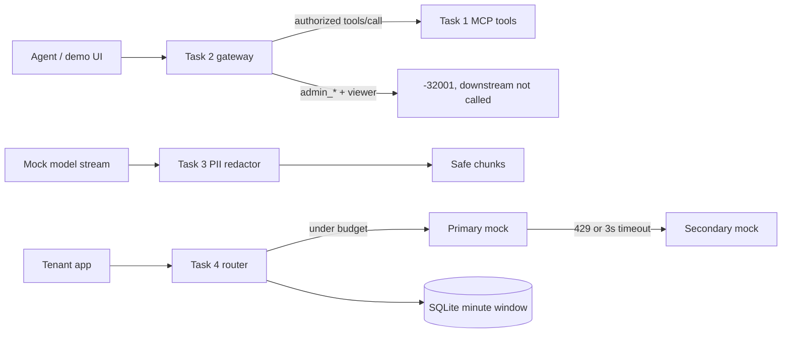

# Quilr FDE take-home

**Daniel Graham** · Solutions Engineer / Forward Deployed Engineer · due **8 September 2026**

Public repo: [https://github.com/PalmCoast/quilr-fde-assessment](https://github.com/PalmCoast/quilr-fde-assessment)

This is the working solution for the Quilr AI take-home: four small control-plane pieces that sit in front of agents and model APIs. The overview mentions five tasks. The problem statements and evaluation criteria that were provided stop at Task 4. This repo implements Tasks 1–4 only.

No vendor keys. Upstream model and MCP traffic is mocked.

## What is in the box

| Workspace | Problem | Start |
| --- | --- | --- |
| `task1/` | Customer MCP server over stdio, official `@modelcontextprotocol/sdk` | `npm run start:task1` |
| `task2/` | MCP security gateway: list every tool, authorize `admin_*` calls | `npm run start:task2` |
| `task3/` | Streaming PII guardrail with a short ambiguous-tail buffer | `npm run start:task3` |
| `task4/` | 50,000 tokens/min/tenant in SQLite + primary → secondary failover | `npm run start:task4` |
| `demo/` | Click-through UI for all four at [http://127.0.0.1:43121](http://127.0.0.1:43121) | `npm run demo` |



## Run it

Requires Node 22+ (this repo uses the built-in `node:sqlite` module).

```bash
npm install
npm test
npm run demo
```

Then open [http://127.0.0.1:43121](http://127.0.0.1:43121).

Individual processes:

```bash
npm run start:task1   # stdio MCP — speak JSON-RPC on stdin
npm run start:task2   # http://127.0.0.1:43122/mcp
npm run start:task3   # http://127.0.0.1:43123/redact/stream
npm run start:task4   # http://127.0.0.1:43124/v1/chat/completions
```

### Demo tokens

These are fixtures, not secrets. They are hardcoded so a reviewer does not have to hunt through env files.

| Role | Header | What it does |
| --- | --- | --- |
| Admin | `Authorization: Bearer admin-token` | Task 2 admin role. Can call `admin_*` tools. |
| Viewer | `Authorization: Bearer viewer-token` | Task 2 viewer role. Can list every tool, including `admin_*`. Cannot call them. Any other Bearer token is also a viewer. |
| Tenant | `Authorization: Bearer tenant-demo` | Task 4 tenant id used for the 50,000 token/minute budget. |

## Architecture

TypeScript npm workspaces. Each task is its own package with a small public surface and Vitest coverage. The demo package imports the four libraries and mounts them on one Node `http` server.

```
task1/   official MCP SDK, stdio transport, Zod tool schemas
task2/   JSON-RPC proxy + Bearer role check in front of a local downstream
task3/   streaming redactor: flush the safe prefix, hold only the ambiguous tail
task4/   SQLite token ledger + 3s primary timeout + fixed error envelope
demo/    static UI + HTTP adapters, port 43121
```

There is no `task5/` directory.

## Design decisions, in plain English

**Task 1 — stay on the official SDK, keep stdout clean.**
The server is an `McpServer` from `@modelcontextprotocol/sdk` with `StdioServerTransport`. Tool arguments are Zod schemas, so a bad `customer_id`, a non-positive refund amount, or a short reason never reach the mock ledger. The current SDK often returns that rejection as a tool result with `isError: true` rather than a protocol-level JSON-RPC error. The handlers also embed MCP `-32602` in the error payload, and the tests accept either shape. Logs go to stderr only. stdout is JSON-RPC frames, one object per line.

**Task 2 — listing is not authorization.**
A viewer is allowed to see `admin_*` tools in `tools/list`. That matches how real MCP clients work: they discover the catalog, then get stopped at call time. `Bearer admin-token` is admin. Any other well-formed Bearer token is a viewer. A viewer `tools/call` whose name starts with `admin_` returns JSON-RPC `-32001 Unauthorized Tool Call` and the gateway returns without calling downstream. That is the whole security property.

**Task 3 — hold the tail, not the stream.**
Email, SSN, and Luhn-valid card numbers can arrive split across chunks (`jane.doe@` + `acme.com`). The redactor keeps a suffix only while that suffix could still become one of those three patterns. A finished sentence with a trailing space flushes immediately. At end-of-stream the remaining buffer is redacted and released. Replacement text is always `[REDACTED]`. Cards use Luhn so a random 16-digit order number is not wiped.

**Task 4 — budget first, then failover, never leak internals.**
Each tenant gets 50,000 tokens per UTC minute, stored in SQLite so two processes can share a file if someone points `TASK4_DB` at disk. Tokens are reserved before the upstream call. If the primary returns 429 or does not finish in 3 seconds, the same reserved budget is reused on the secondary. Other primary failures do not silently hop — that would hide application bugs. Client errors are a fixed `{ error: { code, message, retryable } }` object. Catch-all handlers swallow stacks.

**Mocks on purpose.**
An FDE take-home should show the control plane, not a paid OpenAI account. Primary and secondary are in-process mocks with injectable 429 / timeout behavior.

## Tests

`npm test` runs Vitest in every workspace — **51 tests**, all aimed at the published rubric: valid and invalid tool calls, gateway allow/deny and "downstream not hit", cross-chunk PII, TTFT hold policy, per-tenant token math, 429 and timeout failover, and a sealed error envelope.

| Package | Tests | What it covers |
| --- | --- | --- |
| `@quilr/task1` | 11 | Tool list, happy paths, `-32602` / `isError`, stdio stdout vs stderr |
| `@quilr/task2` | 10 | Admin vs viewer, `admin_*` deny, no downstream on deny |
| `@quilr/task3` | 14 | Email / SSN / card, split chunks, short hold |
| `@quilr/task4` | 13 | 50k default, isolation, SQLite persistence, failover, envelope |
| `@quilr/demo` | 3 | Health tokens, viewer deny, streamed redaction through the UI server |

## 30-minute interview script

Use this if we walk the repo live. Keep the demo up at `http://127.0.0.1:43121`.

**0:00–3:00 — Frame the job.** Quilr sits between agents and the tools/models they call. This take-home is four slices of that path: a governed tool server, a gateway, a stream guardrail, and a tenant router. There was no Task 5 statement in the brief I received.

**3:00–9:00 — Task 1.** Show `task1/src/createServer.ts`. Point at the Zod schemas and the stderr logger. In the demo, fetch `CUST-10001`, then click **Invalid id**. Call out that tests accept either protocol `-32602` or tool `isError` because that is what the official SDK actually emits.

**9:00–15:00 — Task 2.** Switch the demo token to `viewer-token`. Run `tools/list` — `admin_list_customers` is visible. Call it — `-32001`, and mention the unit test that asserts `downstream.calls` stays empty. Switch to `admin-token` and succeed. The sentence to leave them with: *discovery is not permission*.

**15:00–21:00 — Task 3.** Walk `splitSafePrefix` in `task3/src/redact.ts`. Type a sentence that ends with a space — nothing is held. Type `support` or `4111` as the last token — only that token is held. Stream the sample paragraph and show three `[REDACTED]` marks from chunks that individually were not complete PII.

**21:00–27:00 — Task 4.** Show the SQLite ledger and the 50,000 default. In the demo, set primary to 429, send a completion, show `upstream: "secondary"`. Set timeout, same result. Burn the budget with a large `tokens` value and show the envelope has no stack. Mention why a primary 500 does **not** fail over.

**27:00–30:00 — What I would do after an offer.** Wire the gateway in front of a real MCP transport, add audit rows next to the deny path, and replace the regex redactor with the same streaming hold plus a compiled recognizer. Ask what production token accounting Quilr already uses (prompt vs reserved `max_tokens`).

## LinkedIn blurb

> I just published my Quilr AI Solutions Engineer / FDE take-home: a small TypeScript control plane for agent tools and model traffic.
>
> Four pieces: an official-SDK MCP server with Zod-checked customer/refund tools, a Bearer gateway that lets viewers *see* admin tools but not call them, a streaming PII redactor that only holds the ambiguous tail, and a 50k tokens/min SQLite limiter with 429/timeout failover and a sealed error envelope.
>
> No Task 5 — the problem set I received ends at Task 4.
>
> Repo: https://github.com/PalmCoast/quilr-fde-assessment

Feel free to paste that as-is or trim it.

## No Task 5

The take-home overview mentions five tasks. The Google Doc I was given includes only four problem statements and ends at the Task 4 evaluation criteria. I did not invent a fifth exercise, and this repository has no `task5/` folder.

If Quilr later shares Task 5, it can land in a follow-up commit without reshaping Tasks 1–4.

## Candidate

- Name: Daniel Graham
- Role: Solutions Engineer / FDE
- Deadline: 8 September 2026
- Stack: TypeScript, Node 22, npm workspaces, Vitest, official MCP TypeScript SDK, `node:sqlite`
